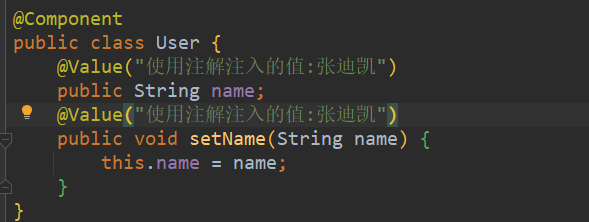
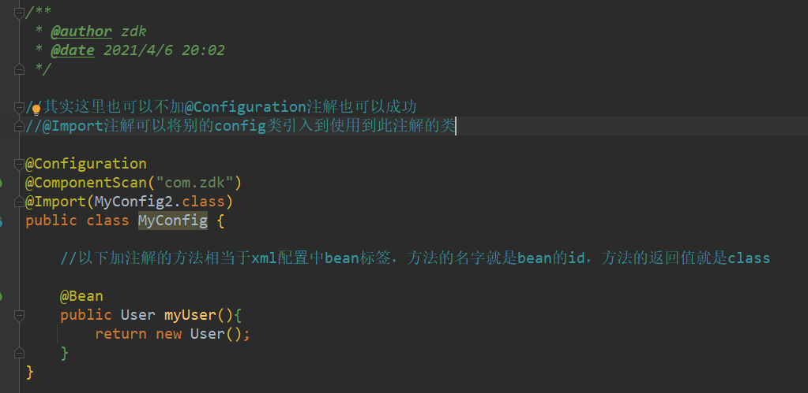
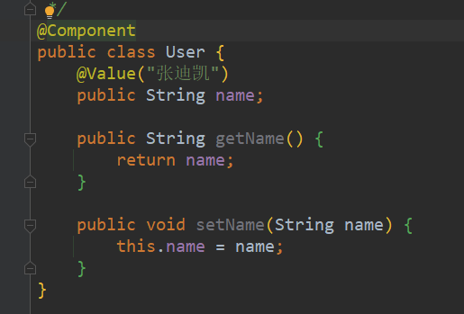
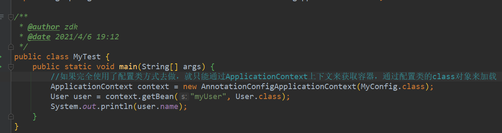

##常用依赖
```xml
<dependencies>
        <dependency>
            <groupId>junit</groupId>
            <artifactId>junit</artifactId>
            <version>4.11</version>
        </dependency>
        <!-- https://mvnrepository.com/artifact/org.springframework/spring-webmvc -->
        <dependency>
            <groupId>org.springframework</groupId>
            <artifactId>spring-webmvc</artifactId>
            <version>5.3.5</version>
        </dependency>
        <dependency>
            <groupId>org.projectlombok</groupId>
            <artifactId>lombok</artifactId>
            <version>1.18.18</version>
        </dependency>
    </dependencies>
```

##常用bean的xml文件配置
```xml
<?xml version="1.0" encoding="UTF-8"?>
<beans xmlns="http://www.springframework.org/schema/beans"
       xmlns:xsi="http://www.w3.org/2001/XMLSchema-instance"
       xmlns:context="http://www.springframework.org/schema/context"
       xsi:schemaLocation="http://www.springframework.org/schema/beans
        https://www.springframework.org/schema/beans/spring-beans.xsd
        http://www.springframework.org/schema/context
        https://www.springframework.org/schema/context/spring-context.xsd
        http://www.springframework.org/schema/aop
        https://www.springframework.org/schema/aop/spring-aop.xsd
">

    <!--    配置注解的支持-->
    <context:annotation-config/>
</beans>
```

##注解说明
- @Autowired:自动装配,通过类型，名字,
    如果Autowired不能唯一自动装配上属性，则需要通过@Qualifier(value="")
- @Nullable:字段标记了这个注解，说明该字段可以为null  
- @Resource:自动装配,也是先通过类型再名字
  
- @Component:注解(义为组成部分、组件)等价于,
  <bean id="user" class="com.zdk.pojo.User />
  
- @Value注解的使用(放到属性上和set方法上是一样的)
  
  
- @Repository注解用于dao层时的注入，和@Component类似 只是习惯于在dao用此注解
- @Service注解用于service层时的注入
- @Controller注解用于controller层的注入，同上
- 以上注解使用时必须被<context:component-scan base-package="com.zdk.pojo"/>
  扫描到才会生效,这三个和@Component功能一样，等价。都代表将某个类注入到
  spring容器中，进行装配bean
  

- 使用纯Java形式完成bean.xml配置文件的操作.
  大致的步骤是，创建一个配置类，使用@Configuration进行注解，在其内部的方法中，
  使用@Bean进行注解，@Configuration就类似一个<beans>标签，@Bean相当于一个<bean>子标签，
  @ComponentScan("com.zdk")是扫描包用的，@Import(MyConfig2.class)可以引入其他的配置类  
