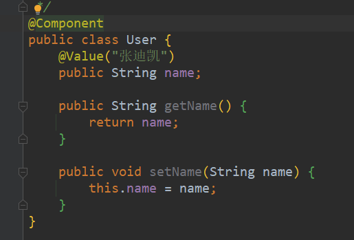

##常用依赖
```xml
<dependencies>
        <dependency>
            <groupId>junit</groupId>
            <artifactId>junit</artifactId>
            <version>4.11</version>
        </dependency>
        <!-- https://mvnrepository.com/artifact/org.springframework/spring-webmvc -->
        <dependency>
            <groupId>org.springframework</groupId>
            <artifactId>spring-webmvc</artifactId>
            <version>5.3.5</version>
        </dependency>
        <dependency>
          <groupId>org.springframework</groupId>
          <artifactId>spring-jdbc</artifactId>
          <version>5.3.5</version>
        </dependency>
        <dependency>
            <groupId>org.projectlombok</groupId>
            <artifactId>lombok</artifactId>
            <version>1.18.18</version>
        </dependency>
    </dependencies>
```

##常用bean的xml文件配置
```xml
<?xml version="1.0" encoding="UTF-8"?>
<beans xmlns="http://www.springframework.org/schema/beans"
       xmlns:xsi="http://www.w3.org/2001/XMLSchema-instance"
       xmlns:context="http://www.springframework.org/schema/context"
       xsi:schemaLocation="http://www.springframework.org/schema/beans
        https://www.springframework.org/schema/beans/spring-beans.xsd
        http://www.springframework.org/schema/context
        https://www.springframework.org/schema/context/spring-context.xsd
        http://www.springframework.org/schema/aop
        https://www.springframework.org/schema/aop/spring-aop.xsd">

    <!--    配置注解的支持-->
    <context:annotation-config/>
</beans>
```

##注解说明
- @Autowired:自动装配,通过类型，名字,
    如果Autowired不能唯一自动装配上属性，则需要通过@Qualifier(value="")
- @Nullable:字段标记了这个注解，说明该字段可以为null  
- @Resource:自动装配,也是先通过类型再名字
  
- @Component:注解(义为组成部分、组件)等价于,
  <bean id="user" class="com.zdk.pojo.User />
  
- @Value注解的使用(放到属性上和set方法上是一样的)
  
  
- @Repository注解用于dao层时的注入，和@Component类似 只是习惯于在dao用此注解
- @Service注解用于service层时的注入
- @Controller注解用于controller层的注入，同上
- 以上注解使用时必须被<context:component-scan base-package="com.zdk.pojo"/>
  扫描到才会生效,这三个和@Component功能一样，等价。都代表将某个类注入到
  spring容器中，进行装配bean
  

- 使用纯Java形式完成bean.xml配置文件的操作.
  大致的步骤是，创建一个配置类，使用@Configuration进行注解，在其内部的方法中，
  使用@Bean进行注解，@Configuration就类似一个<beans>标签，@Bean相当于一个<bean>子标签，
  @ComponentScan("com.zdk")是扫描包用的，@Import(MyConfig2.class)可以引入其他的配置类  

  
##代理模式
###角色分析
  - 抽象角色：一般使用接口或者抽象类来解决
  - 真实角色：被代理的角色
  - 代理角色：代理真实角色，代理真实角色后，可以实现代理角色的功能，且可以做一些
    其他的附属(公共)操作
    

###代码步骤
1. 写接口

```java
public interface Rent {
public void rent();
}
```

2. 真实角色

```java
public class Host implements Rent{
    @Override
    public void rent() {
        System.out.println("房东要出租房子");
    }
}
```

3. 代理角色
   
```java
//代理类(代理角色)

public class Proxy {
    private Host host;
    public Proxy() {
    }
    public Proxy(Host host) {
        this.host = host;
    }
    public void rent(){
        host.rent();
    }
    public void seeHouse(){
        System.out.println("中介带你看房");
    }
    public void heTong(){
        System.out.println("中介和你签租赁合同");
    }
    public void money(){
        System.out.println("中介收中介费");
    }
}
```

4. 客户端访问代理角色

```java
public class Client {
    public static void main(String[] args) {
        Host host=new Host();
        //代理,中介帮房东出租房子,但是中介(代理角色)能执行一些其他附属操作
        Proxy proxy = new Proxy(host);
        //通过代理实现,不用找房东,直接找中介租房
        proxy.rent();
    }
}
```
###1.静态代理
####好处：
  - 可以使真实角色的操作更加纯粹，不用去关注一些公共的业务
  - 公共业务就交给代理角色，实现了业务的分工
  - 公共业务发生扩展时，可以方便进行集中管理
####缺点:
  - 一个真实角色就会产生一个代理角色；代码量翻倍，开发效率变低,可用动态代理解决

###2.动态代理
####好处：
  - 可以使真实角色的操作更加纯粹，不用去关注一些公共的业务
  - 公共业务就交给代理角色，实现了业务的分工
  - 公共业务发生扩展时，可以方便进行集中管理
  - 一个动态代理类代理的是一个接口，一般对应一类业务
  - 一个动态代理类可以代理多个类，只要这些类都实现了同一个接口
####特点  
  - 动态代理和静态代理角色一样
  - 动态代理的代理类是动态生成的，不是直接写好的
  - 动态代理分为两大类
1. 基于接口的动态代理
  - JDK动态代理
2. 基于类的动态代理
  - cglib
  - Java字节码实现：Javassist

####需要了解两个类
  - Proxy(代理)
  

  - invocationHandler(调用处理程序)

##SpringAop
